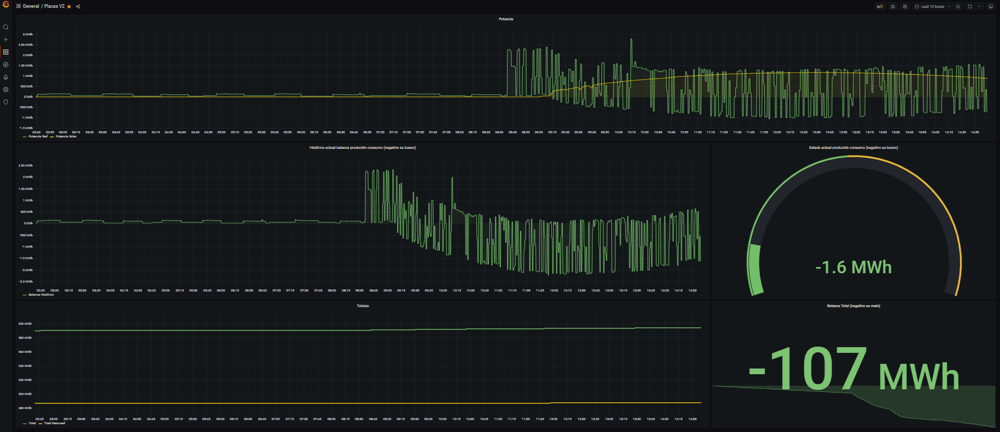

## ShellyMetrics

A Shelly controller is a device installed on an electric network witch is dedicated to export the current status with his endpoint /status.
This application is responsible for scraping the Shelly controller located on the same local network and exporting the status as Prometheus-style metrics.

Then, if we got it deployed with a Prometheus and Grafana services, we can illustrate the electric production and consumption.

Example below.

